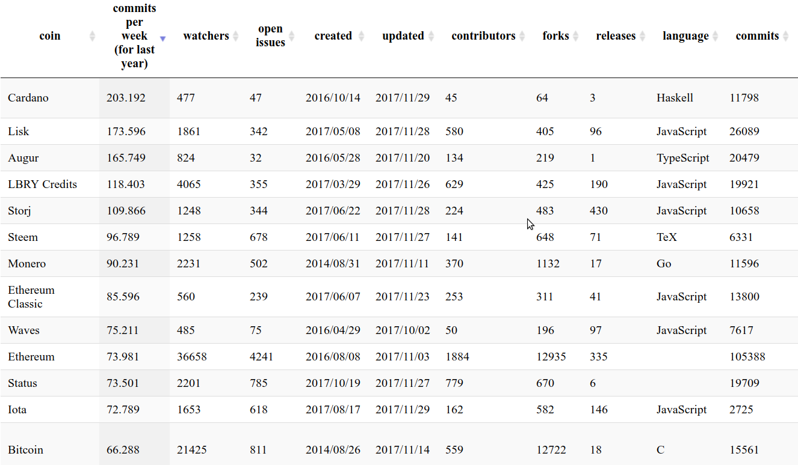

Static site for comparing github repos/users.

[live site](https://wassname.github.io/compare_altcoin_development/src/)

# Screenshot

TODO:

- [x] bitbucket
- [x] github organisations
- [x] progbar
- [x] user input
- [ ] detect data from forks?
- [ ] finer stats, e.g. total contributions, change in lines of code etc
